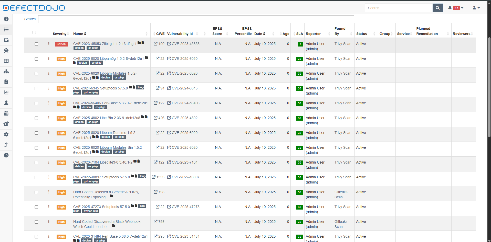

## 📚 Explicando o Código

O código-fonte da aplicação `app.py` possui uma vulnerabilidade de XSS (Cross Site Scripting - Reflected) onde permite a injeção de código na aplicação web. Outro arquivo python é o `secrets_test.py` que contém secrets Keys falsas onde em ambos os casos da aplicação web é uma porta de entrada para que Agentes Maliciosos explorem essas vulnerabilidades.

---

## Decisões tomadas enquanto montava a pipeline

Ao montar a pipeline, meu objetivo foi garantir uma análise completa e automatizada de vulnerabilidades tanto no código quanto na imagem Docker, então optei por utilizar a ferramenta `Gitleaks` para identificar segredos contidos dentro do código, e para uma analise estática focada no código python utilizei a ferramenta `Bandit` devido sua integração e especialidade nessa linguagem, para fazer o scan da imagem Docker utilizei a ferramenta `Trivy` por sua especialidade em analisar vulnerabilidades e segredos. 

Usei Docker Compose para facilitar a orquestração dos containers e um Makefile para simplificar a execução dos comandos, garantindo que as etapas fossem repetíveis e organizadas, com os relatórios sempre gerados em diretórios específicos para fácil consulta.

E por fim utilizei o gerenciador de vulnerabilidades `DefectDojo` para uma melhor visualização dos scans.

---

## 💻 Como Executar a pipepline

* Crie um arquivo `reports` através do comando `mkidr reports`.

* Depois para executar as ferramentas veja as instruções `como rodar as ferramentas`.

* O arquivo de configuração das ferramentas está dentro do `docker-compose.yml`.

---
## 🚀 Acessando o DefectDojo

credenciais de acesso ao DefectDojo:

* usuário: `admin`
* senha: `Admin@123`

* Para enviar os scans para o `DefectDojo` utilize o comando: `make all`.

* Depois acesse: `http://localhost:8080/`

---

## ⚒️ Ferramentas utilizadas até o momento 

* Gitleaks como SAST.
* Bandit para encontrar vulnerabilidades no código python.
* Trivy para encontrar vulnerabilidades como segredos e imagens Docker. 
* Makefile como o orquestrador da pipeline.
* DefectDojo como gerenciador de vulnerabilidades.

---

## 🪖 Para rodar as ferramentas 

* Para rodar o `bandit` basta utilizar o comando: `docker compose up --build bandit` ou `make bandit`.

* Para rodar o `gitleaks` basta utilizar o comando: `docker compose run --rm gitleaks` ou ``make gitleaks`.

* Para rodar o `trivy` basta utilizar o comando: `make pipeline`.

---

## 🔍 Evidências (prints e logs de scans)

DefectDojo com os findings:

