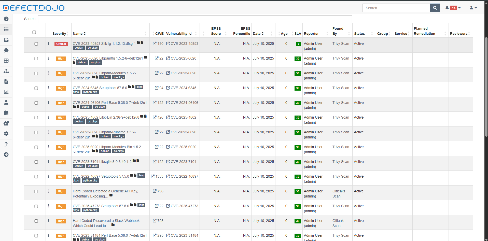

## 📚 Explicando o Código

O código-fonte da aplicação `app.py` possui uma vulnerabilidade de XSS (Cross Site Scripting - Reflected), que permite a injeção de código na aplicação web. Outro arquivo Python é o `secrets_test.py`, que contém secret keys falsas. Em ambos os casos, a aplicação web apresenta portas de entrada que podem ser exploradas por agentes maliciosos.

---

## Decisões tomadas enquanto montava a pipeline

Ao montar a pipeline, meu objetivo foi garantir uma análise completa e automatizada de vulnerabilidades tanto no código quanto na imagem Docker. Por isso, optei por utilizar a ferramenta `Gitleaks` para identificar segredos contidos no código. Para uma análise estática focada em código Python, utilizei a ferramenta `Bandit`, devido à sua integração e especialidade nessa linguagem. Para realizar o scan da imagem Docker, utilizei a ferramenta `Trivy`, por sua especialidade em analisar vulnerabilidades e segredos.

Usei o `Docker Compose` para facilitar a orquestração dos containers e um  `Makefile` para simplificar a execução dos comandos, garantindo que as etapas fossem repetíveis e organizadas, com os relatórios sempre gerados em diretórios específicos para fácil consulta.

Por fim, utilizei o gerenciador de vulnerabilidades `DefectDojo` para uma melhor visualização dos scans.

---

## 💻 Como Executar a pipepline

* Para executar as ferramentas veja as instruções `como rodar as ferramentas`.

* O arquivo de configuração das ferramentas está dentro do `docker-compose.yml`.

---
## 🚀 Acessando o DefectDojo

Credenciais de acesso ao DefectDojo:

* Usuário: `admin`
* Senha: `Admin@123`

* Para enviar rodar os scans e enviar para  `DefectDojo` utilize o comando: `make all`.

* Depois, acesse: `http://localhost:8080/`

---

## ⚒️ Ferramentas utilizadas até o momento 

* `Gitleaks` como SAST.
* `Bandit` para encontrar vulnerabilidades no código python.
* `Trivy` para encontrar vulnerabilidades e segredos em imagens Docker. 
* `Makefile` como o orquestrador da pipeline.
* `DefectDojo` como gerenciador de vulnerabilidades.

---

## 🪖 Para rodar as ferramentas 

* Para rodar o `bandit`, utilize o comando: `docker compose up --build bandit` ou `make bandit`.

* Para rodar o `gitleaks`, utilize o comando: `docker compose run --rm gitleaks` ou ``make gitleaks`.

* Para rodar o `trivy`, utilize o comando: `make pipeline`.

* Para rodar todas as ferramentas (recomendado): `make all`.

---

## 🔍 Evidências (prints e logs de scans)

DefectDojo com os findings:

